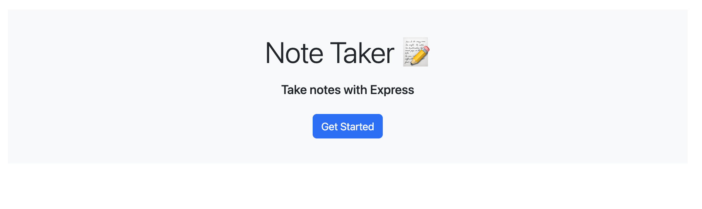

# NoteTaker
  

  ## Table of Contents
  *[Description](#description)  
  *[Installation](#Installation)  
  *[Usage](#usage)  
  *[Contribution](#contribution)  
  *[Tests](#tests)  
  *[Questions](#questions)  
  *[Credits](#credits)  

  ## Description 
  This application helps the user keep track of their notes. You can look at previous notes as well as delete notes. 

  ## Installation 
  In order for this application to work, npm needs to be installed along with dependancies for the project. Once installed, node server needs to be submitted in the terminal to start the application/server. localhost:3008 is the url that will be used in the browser to get to the application on the browser. 

  ## Usage 
  This application is used to get notes from a database as well as delete from the database. 
  

  ## Licenses 
  
  This project is using the MIT license. To learn more, please click the license link listed above.

  ## Contribution 
  I watched this video to get a better understanding of delete and post methods  https://www.youtube.com/watch?v=XLsq6-biy5I. I also read documentation on mdn for http methods as well.

  ## Tests 
  No tests 

  ## Questions 
  Have any questions regarding this project?  
  Send me a message on...  
  Github: https://github.com/gabe-velasquez  
  Email: gabriel.velasquez0116@gmail.com  

  ## Credits 
  Gabe Velasquez
